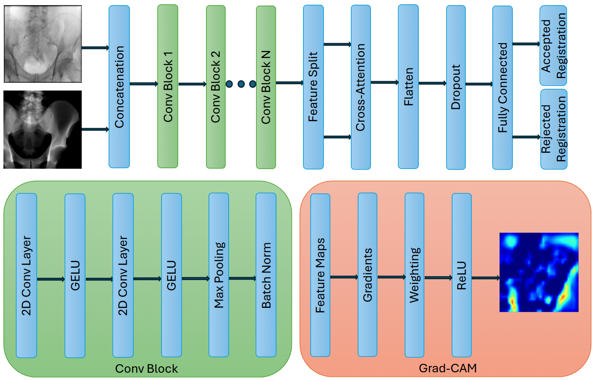

# XAI-2D3D-RegQuality
Explainable AI for Collaborative Assessment of 2D/3D Registration Quality
<div style="text-align:center;">
  <a href="https://huggingface.co/datasets/suemincho/2D3D-RegQuality/">
    
  </a>
</div>

<div align="center">
  
</div>

---

## Installation

### 1. Clone the repository

```bash
git clone https://github.com/jasminecho1008/XAI-2D3D-RegQuality.git
cd XAI-2D3D-RegQuality
```

### 2. Create a new conda environment

```bash
conda create -n XAI-2D3D-RegQuality python==3.9
conda activate XAI-2D3D-RegQuality
pip install -e .
```

### 3. Install the dependencies

```bash
conda env update -f environment.yml
```

## Usage

### Python Script

To run hyperparameter optimization: 

```bash
bash optuna_hpo.sh 
```

To train model: 

```bash
bash train.sh 
```

To evaluate model:

```bash
bash inference.sh 
```

To generate Grad-CAM heatmaps:

```bash
bash gradcam.sh 
```

## Citation

If you use XAI-2D3D-RegQuality in your research, please consider citing our paper:
